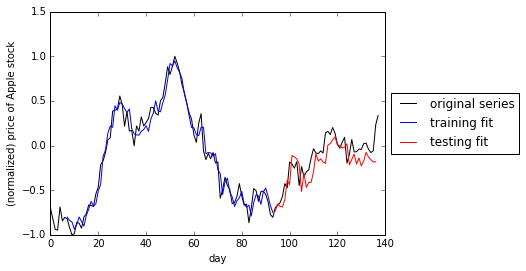

# Artificial Intelligence Nanodegree



## Recurrent Neural Network Projects

Welcome to the Recurrent Neural Network Project in the Artificial Intelligence Nanodegree! In this notebook, some template code has already been provided for you, and you will need to implement additional functionality to successfully complete this project. You will not need to modify the included code beyond what is requested. Sections that begin with **'Implementation'** in the header indicate that the following block of code will require additional functionality which you must provide. Instructions will be provided for each section and the specifics of the implementation are marked in the code block with a 'TODO' statement. Please be sure to read the instructions carefully!

In addition to implementing code, there will be questions that you must answer which relate to the project and your implementation. Each section where you will answer a question is preceded by a **'Question X'** header. Carefully read each question and provide thorough answers in the following text boxes that begin with **'Answer:'**. Your project submission will be evaluated based on your answers to each of the questions and the implementation you provide.  

>**Note:** Code and Markdown cells can be executed using the **Shift + Enter** keyboard shortcut. In addition, Markdown cells can be edited by typically double-clicking the cell to enter edit mode.

### Implementation TODOs in this notebook

This notebook contains two problems, cut into a variety of TODOs.  Make sure to complete each section containing a TODO marker throughout the notebook.  For convinence we provide links to each of these sections below.

[TODO #1: Implement a function to window time series](#TODO_1)

[TODO #2: Create a simple RNN model using keras to perform regression](#TODO_2)

[TODO #3: Finish cleaning a large text corpus](#TODO_3)

[TODO #4: Implement a function to window a large text corpus](#TODO_4)

[TODO #5: Create a simple RNN model using keras to perform multiclass classification](#TODO_5)

[TODO #6: Generate text using a fully trained RNN model and a variety of input sequences](#TODO_6)


# Problem 1: Perform time series prediction 

In this project you will perform time series prediction using a Recurrent Neural Network regressor.  In particular you will re-create the figure shown in the notes - where the stock price of Apple was forecasted (or predicted) 7 days in advance.  In completing this exercise you will learn how to construct RNNs using Keras, which will also aid in completing the second project in this notebook.

The particular network architecture we will employ for our RNN is known as  [Long Term Short Memory (LTSM)](https://en.wikipedia.org/wiki/Long_short-term_memory), which helps significantly avoid technical problems with optimization of RNNs.  

## 1.1 Getting started

First we must load in our time series - a history of around 140 days of Apple's stock price.  Then we need to perform a number of pre-processing steps to prepare it for use with an RNN model.  First off, it is good practice to normalize time series - by normalizing its range.  This helps us avoid serious numerical issues associated how common activation functions (like tanh) transform very large (positive or negative) numbers, as well as helping us to avoid related issues when computing derivatives.

Here we normalize the series to lie in the range [0,1] [using this scikit function](http://scikit-learn.org/stable/modules/generated/sklearn.preprocessing.MinMaxScaler.html), but it is also commonplace to normalize by a series standard deviation.


```python
### Load in necessary libraries for data input and normalization
%matplotlib inline
import numpy as np
import matplotlib.pyplot as plt
from sklearn.preprocessing import MinMaxScaler

### load in and normalize the dataset
dataset = np.loadtxt('datasets/normalized_apple_prices.csv')
```

Lets take a quick look at the (normalized) time series we'll be performing predictions on.


```python
# lets take a look at our time series
plt.plot(dataset)
plt.xlabel('time period')
plt.ylabel('normalized series value')
```


    <matplotlib.text.Text at 0x7f8d29c24b70>


## 1.2  Cutting our time series into sequences

Remember, our time series is a sequence of numbers that we can represent in general mathematically as 

$$s_{0},s_{1},s_{2},...,s_{P}$$

where $s_{p}$ is the numerical value of the time series at time period $p$ and where $P$ is the total length of the series.  In order to apply our RNN we treat the time series prediction problem as a regression problem, and so need to use a sliding window to construct a set of associated input/output pairs to regress on.  This process is animated in the gif below.


For example - using a window of size T = 5 (as illustrated in the gif above) we produce a set of input/output pairs like the one shown in the table below

$$\begin{array}{c|c}
\text{Input} & \text{Output}\\
\hline \color{CornflowerBlue} {\langle s_{1},s_{2},s_{3},s_{4}\rangle} & \color{Goldenrod}{ s_{5}} \\
\ \color{CornflowerBlue} {\langle s_{2},s_{3},s_{4},s_{5} \rangle } & \color{Goldenrod} {s_{6} } \\
\color{CornflowerBlue}  {\vdots} & \color{Goldenrod} {\vdots}\\
\color{CornflowerBlue} { \langle s_{P-4},s_{P-3},s_{P-2},s_{P-1} \rangle } & \color{Goldenrod} {s_{P}}
\end{array}$$

Notice here that each input is a sequence (or vector) of length 4 (and in general has length equal to the window size T) while each corresponding output is a scalar value.  Notice also how given a time series of length P and window size T = 5 as shown above, we created P - 5  input/output pairs.  More generally, for a window size T we create P - T such pairs.

Now its time for you to window the input time series as described above!  

<a id='TODO_1'></a>

**TODO:** Fill in the function below - called **window_transform_series** - that runs a sliding window along the input series and creates associated input/output pairs.    Note that this function should input a) the series and b) the window length, and return the input/output subsequences.  Make sure to format returned input/output as generally shown in table above (where window_size = 5), and make sure your returned input is a numpy array.

-----

You can test your function on the list of odd numbers given below


```python
odd_nums = np.array([1,3,5,7,9,11,13])
```

To window this sequence with a window_size = 2 using the **window_transform_series** you should get the following input/output pairs

Again - you can check that your completed **window_transform_series** function works correctly by trying it on the odd_nums sequence - you should get the above output.

-----


```python
### TODO: fill out the function below that transforms the input series and window-size into a set of input/output pairs for use with our RNN model
def window_transform_series(series,window_size):
    # containers for input/output pairs
    X = []
    y = []

    for i in range(len(series)-window_size-1):
        a = series[i:(i+window_size)]
        X.append(a)
        y.append(series[i + window_size])
        
    # reshape each 
    X = np.asarray(X)
    X.shape = (np.shape(X)[0:2])
    y = np.asarray(y)
    y.shape = (len(y),1)
    
    return X,y
```


```python
# run a window of size 2 over the odd number sequence and display the results
window_size = 2
X,y = window_transform_series(odd_nums,window_size)

# print out input/output pairs --> here input = X, corresponding output = y
print ('--- the input X will look like ----')
print (X)

print ('--- the associated output y will look like ----')
print (y)

print ('the shape of X is ' + str(np.shape(X)))
print ('the shape of y is ' + str(np.shape(y)))
print('the type of X is ' + str(type(X)))
print('the type of y is ' + str(type(y)))
```

    --- the input X will look like ----
    [[1 3]
     [3 5]
     [5 7]
     [7 9]]
    --- the associated output y will look like ----
    [[ 5]
     [ 7]
     [ 9]
     [11]]
    the shape of X is (4, 2)
    the shape of y is (4, 1)
    the type of X is <class 'numpy.ndarray'>
    the type of y is <class 'numpy.ndarray'>
    

With this function in place apply it to the series in the Python cell below.  We use a window_size = 7 for these experiments.


```python
# window the data using your windowing function
window_size = 7
X,y = window_transform_series(series = dataset,window_size = window_size)
```

## 1.3  Splitting into training and testing sets

In order to perform proper testing on our dataset we will lop off the last 1/3 of it for validation (or testing).  This is that once we train our model we have something to test it on (like any regression problem!).  This splitting into training/testing sets is done in the cell below.

Note how here we are **not** splitting the dataset *randomly* as one typically would do when validating a regression model.  This is because our input/output pairs *are related temporally*.   We don't want to validate our model by training on a random subset of the series and then testing on another random subset, as this simulates the scenario that we receive new points *within the timeframe of our training set*.  

We want to train on one solid chunk of the series (in our case, the first full 2/3 of it), and validate on a later chunk (the last 1/3) as this simulates how we would predict *future* values of a time series.


```python
# split our dataset into training / testing sets
train_test_split = int(np.ceil(2*len(y)/float(3)))   # set the split point

# partition the training set
X_train = X[:train_test_split,:]
y_train = y[:train_test_split]

# keep the last chunk for testing
X_test = X[train_test_split:,:]
y_test = y[train_test_split:]

# NOTE: to use keras's RNN LSTM module our input must be reshaped to [samples, stepsize, window size] 
X_train = np.asarray(np.reshape(X_train, (X_train.shape[0], 1, window_size)))
X_test = np.asarray(np.reshape(X_test, (X_test.shape[0], 1, window_size)))
```

<a id='TODO_2'></a>

## 1.4  Build and run an RNN regression model

Having created input/output pairs out of our time series and cut this into training/testing sets, we can now begin setting up our RNN.  We use Keras to quickly build a two hidden layer RNN of the following specifications

- layer 1 uses an LSTM module with 5 hidden units (note here the input_shape = (1,window_size))
- layer 2 uses a fully connected module with one unit
- the 'mean_squared_error' loss should be used (remember: we are performing regression here)

This can be constructed using just a few lines - see e.g., the [general Keras documentation](https://keras.io/getting-started/sequential-model-guide/) and the [LTSM documentation in particular](https://keras.io/layers/recurrent/) for examples of how to quickly use Keras to build neural network models.  Make sure you are initializing your optimizer given the [keras-recommended approach for RNNs](https://keras.io/optimizers/) (given in the cell below).  


```python
import cv2
import keras
```


```python
### TODO: create required RNN model
# import keras network libraries
from keras.models import Sequential
from keras.layers import Dense
from keras.layers import LSTM
import keras

# given - fix random seed - so we can all reproduce the same results on our default time series
np.random.seed(0)


# TODO: build an RNN to perform regression on our time series input/output data
#create and fit the LSTM network
model = Sequential()
model.add(LSTM(5, input_shape=(1, window_size)))
model.add(Dense(1))


# build model using keras documentation recommended optimizer initialization
optimizer = keras.optimizers.RMSprop(lr=0.001, rho=0.9, epsilon=1e-08, decay=0.0)

# compile the model
model.compile(loss='mean_squared_error', optimizer=optimizer)

# print summary
model.summary()
```

    _________________________________________________________________
    Layer (type)                 Output Shape              Param #   
    =================================================================
    lstm_3 (LSTM)                (None, 5)                 260       
    _________________________________________________________________
    dense_3 (Dense)              (None, 1)                 6         
    =================================================================
    Total params: 266
    Trainable params: 266
    Non-trainable params: 0
    _________________________________________________________________
    

With your model built you can now fit the model by activating the cell below!  Note: the number of epochs (np_epochs) and batch_size are preset (so we can all produce the same results).  You can choose to toggle the verbose parameter - which gives you regular updates on the progress of the algorithm - on and off by setting it to 1 or 0 respectively.


```python
# run your model!
history = model.fit(X_train, y_train, epochs=1000, batch_size=50, verbose=0)

#visualize
# list all data in history
print(history.history.keys())

# summarize history for loss
plt.plot(history.history['loss'])
plt.title('model loss')
plt.ylabel('loss')
plt.xlabel('epoch')
plt.legend(['train'], loc='upper left')
plt.savefig('model_loss.png', bbox_inches='tight')
plt.show()
```

    dict_keys(['loss'])
    


## 1.5  Checking model performance

With your model fit we can now make predictions on both our training and testing sets.


```python
# generate predictions for training
train_predict = model.predict(X_train)
test_predict = model.predict(X_test)
```

In the next cell we compute training and testing errors using our trained model - you should be able to achieve at least

*training_accuracy* < 0.02

and 

*testing_accuracy* < 0.02

with your fully trained model.  

If either or both of your accuracies are larger than 0.02 re-train your model - increasing the number of epochs you take (a maximum of around 1,000 should do the job) and/or adjusting your batch_size.


```python
# print out training and testing errors
training_accuracy = model.evaluate(X_train, y_train, verbose=0)
print('training accuracy = ' + str(training_accuracy))

testing_accuracy = model.evaluate(X_test, y_test, verbose=0)
print('testing accuracy = ' + str(testing_accuracy))
```

    training accuracy = 0.0104258714843
    testing accuracy = 0.0258482838439
    

Activating the next cell plots the original data, as well as both predictions on the training and testing sets. 


```python
### Plot everything - the original series as well as predictions on training and testing sets
import matplotlib.pyplot as plt
%matplotlib inline

# plot original series
plt.plot(dataset,color = 'k')

# plot training set prediction
split_pt = train_test_split + window_size 
plt.plot(np.arange(window_size,split_pt,1),train_predict,color = 'b')

# plot testing set prediction
plt.plot(np.arange(split_pt,split_pt + len(test_predict),1),test_predict,color = 'r')

# pretty up graph
plt.xlabel('day')
plt.ylabel('(normalized) price of Apple stock')
plt.legend(['original series','training fit','testing fit'],loc='center left', bbox_to_anchor=(1, 0.5))
plt.show()
```


**Note:** you can try out any time series for this exercise!  If you would like to try another see e.g., [this site containing thousands of time series](https://datamarket.com/data/list/?q=provider%3Atsdl) and pick another one!

# Problem 2: Create a sequence generator

## 2.1  Getting started

In this project you will implement a popular Recurrent Neural Network (RNN) architecture to create an English language sequence generator capable of building semi-coherent English sentences from scratch by building them up character-by-character.  This will require a substantial amount amount of parameter tuning on a large training corpus (at least 100,000 characters long).  In particular for this project we will be using a complete version of Sir Arthur Conan Doyle's classic book The Adventures of Sherlock Holmes.

How can we train a machine learning model to generate text automatically, character-by-character?  *By showing the model many training examples so it can learn a pattern between input and output.*  With this type of text generation each input is a string of valid characters like this one

*dogs are grea*

whlie the corresponding output is the next character in the sentence - which here is 't' (since the complete sentence is 'dogs are great').  We need to show a model many such examples in order for it to make reasonable predictions.

**Fun note:** For those interested in how text generation is being used check out some of the following fun resources:

- [Generate wacky sentences](http://www.cs.toronto.edu/~ilya/rnn.html) with this academic RNN text generator

- Various twitter bots that tweet automatically generated text like[this one](http://tweet-generator-alex.herokuapp.com/).

- the [NanoGenMo](https://github.com/NaNoGenMo/2016) annual contest to automatically produce a 50,000+ novel automatically

- [Robot Shakespeare](https://github.com/genekogan/RobotShakespeare) a text generator that automatically produces Shakespear-esk sentences

## 2.2  Preprocessing a text dataset

Our first task is to get a large text corpus for use in training, and on it we perform a several light pre-processing tasks.  The default corpus we will use is the classic book Sherlock Holmes, but you can use a variety of others as well - so long as they are fairly large (around 100,000 characters or more).  


```python
# read in the text, transforming everything to lower case
text = open('datasets/holmes.txt').read().lower()
print('our original text has ' + str(len(text)) + ' characters')
```

    our original text has 581864 characters
    

Next, lets examine a bit of the raw text.  Because we are interested in creating sentences of English words automatically by building up each word character-by-character, we only want to train on valid English words.  In other words - we need to remove all of the other junk characters that aren't words!


```python
### print out the first 1000 characters of the raw text to get a sense of what we need to throw out
text[:2000]
```


    "\ufeffproject gutenberg's the adventures of sherlock holmes, by arthur conan doyle\n\nthis ebook is for the use of anyone anywhere at no cost and with\nalmost no restrictions whatsoever.  you may copy it, give it away or\nre-use it under the terms of the project gutenberg license included\nwith this ebook or online at www.gutenberg.net\n\n\ntitle: the adventures of sherlock holmes\n\nauthor: arthur conan doyle\n\nposting date: april 18, 2011 [ebook #1661]\nfirst posted: november 29, 2002\n\nlanguage: english\n\n\n*** start of this project gutenberg ebook the adventures of sherlock holmes ***\n\n\n\n\nproduced by an anonymous project gutenberg volunteer and jose menendez\n\n\n\n\n\n\n\n\n\nthe adventures of sherlock holmes\n\nby\n\nsir arthur conan doyle\n\n\n\n   i. a scandal in bohemia\n  ii. the red-headed league\n iii. a case of identity\n  iv. the boscombe valley mystery\n   v. the five orange pips\n  vi. the man with the twisted lip\n vii. the adventure of the blue carbuncle\nviii. the adventure of the speckled band\n  ix. the adventure of the engineer's thumb\n   x. the adventure of the noble bachelor\n  xi. the adventure of the beryl coronet\n xii. the adventure of the copper beeches\n\n\n\n\nadventure i. a scandal in bohemia\n\ni.\n\nto sherlock holmes she is always the woman. i have seldom heard\nhim mention her under any other name. in his eyes she eclipses\nand predominates the whole of her sex. it was not that he felt\nany emotion akin to love for irene adler. all emotions, and that\none particularly, were abhorrent to his cold, precise but\nadmirably balanced mind. he was, i take it, the most perfect\nreasoning and observing machine that the world has seen, but as a\nlover he would have placed himself in a false position. he never\nspoke of the softer passions, save with a gibe and a sneer. they\nwere admirable things for the observer--excellent for drawing the\nveil from men's motives and actions. but for the trained reasoner\nto admit such intrusions into his own delicate and finely\nadjusted temperament was to introduce a dist"


Wow - there's a lot of junk here (i.e., weird uncommon character combinations - as this first character chunk contains the title and author page, as well as table of contents)!  e.g., all the carriage return and newline sequences '\n' and '\r' sequences.  We want to train our RNN on a large chunk of real english sentences - we don't want it to start thinking non-english words or strange characters are valid! - so lets clean up the data a bit.

First, since the dataset is so large and the first few hundred characters contain a lot of junk, lets cut it out.  Lets also find-and-replace those newline tags with empty spaces.


```python
### find and replace '\n' and '\r' symbols - replacing them 
text = text[1302:]
text = text.replace('\n',' ')    # replacing '\n' with '' simply removes the sequence
text = text.replace('\r',' ')
```

Lets see how the first 1000 characters of our text looks now!


```python
### print out the first 1000 characters of the raw text to get a sense of what we need to throw out
text[:1000]
```


    "is eyes she eclipses and predominates the whole of her sex. it was not that he felt any emotion akin to love for irene adler. all emotions, and that one particularly, were abhorrent to his cold, precise but admirably balanced mind. he was, i take it, the most perfect reasoning and observing machine that the world has seen, but as a lover he would have placed himself in a false position. he never spoke of the softer passions, save with a gibe and a sneer. they were admirable things for the observer--excellent for drawing the veil from men's motives and actions. but for the trained reasoner to admit such intrusions into his own delicate and finely adjusted temperament was to introduce a distracting factor which might throw a doubt upon all his mental results. grit in a sensitive instrument, or a crack in one of his own high-power lenses, would not be more disturbing than a strong emotion in a nature such as his. and yet there was but one woman to him, and that woman was the late irene ad"


<a id='TODO_3'></a>

#### TODO: finish cleaning the text

Lets make sure we haven't left any other non-English/proper punctuation (commas, periods, etc., are ok) characters lurking around in the depths of the text.  You can do this by ennumerating all the text's unique characters, examining them, and then replacing any unwanted (non-english) characters with empty spaces!  Once we find all of the text's unique characters, we can remove all of the non-English/proper punctuation ones in the next cell.  Note: don't remove necessary punctuation marks!


```python
### TODO: list all unique characters in the text and remove any non-english ones
# find all unique characters in the text

import string
printable = set(string.printable)

# remove as many non-english characters and character sequences as you can 
filter(lambda x: x in printable, text)

### find and replace '\n' and '\r' symbols - replacing them 
text = text.replace('-',' ')    # replacing '\n' with '' simply removes the sequence
text = text.replace('*',' ')
text = text.replace('\'',' ')
text = text.replace('%',' ')
text = text.replace('/',' ')
text = text.replace('$',' ')
text = text.replace('&',' ')
text = text.replace('(',' ')
text = text.replace(')',' ')
text = text.replace('/',' ')
text = text.replace(';',' ')
text = text.replace('@',' ')
text = text.replace('á',' ')
text = text.replace('à',' ')
text = text.replace('â',' ')
text = text.replace('ó',' ')
text = text.replace('ò',' ')
text = text.replace('ô',' ')
text = text.replace('é',' ')
text = text.replace('è',' ')
text = text.replace('ê',' ')
text = text.replace(':',' ')

# shorten any extra dead space created above
text = text.replace('  ',' ')

### print out the first 1000 characters of the raw text to get a sense of what we need to throw out
text[:10000]
```


    'is eyes she eclipses and predominates the whole of her sex. it was not that he felt any emotion akin to love for irene adler. all emotions, and that one particularly, were abhorrent to his cold, precise but admirably balanced mind. he was, i take it, the most perfect reasoning and observing machine that the world has seen, but as a lover he would have placed himself in a false position. he never spoke of the softer passions, save with a gibe and a sneer. they were admirable things for the observer excellent for drawing the veil from men s motives and actions. but for the trained reasoner to admit such intrusions into his own delicate and finely adjusted temperament was to introduce a distracting factor which might throw a doubt upon all his mental results. grit in a sensitive instrument, or a crack in one of his own high power lenses, would not be more disturbing than a strong emotion in a nature such as his. and yet there was but one woman to him, and that woman was the late irene adler, of dubious and questionable memory. i had seen little of holmes lately. my marriage had drifted us away from each other. my own complete happiness, and the home centred interests which rise up around the man who first finds himself master of his own establishment, were sufficient to absorb all my attention, while holmes, who loathed every form of society with his whole bohemian soul, remained in our lodgings in baker street, buried among his old books, and alternating from week to week between cocaine and ambition, the drowsiness of the drug, and the fierce energy of his own keen nature. he was still, as ever, deeply attracted by the study of crime, and occupied his immense faculties and extraordinary powers of observation in following out those clues, and clearing up those mysteries which had been abandoned as hopeless by the official police. from time to time i heard some vague account of his doings of his summons to odessa in the case of the trepoff murder, of his clearing up of the singular tragedy of the atkinson brothers at trincomalee, and finally of the mission which he had accomplished so delicately and successfully for the reigning family of holland. beyond these signs of his activity, however, which i merely shared with all the readers of the daily press, i knew little of my former friend and companion. one night it was on the twentieth of march, 1888 i was returning from a journey to a patient for i had now returned to civil practice , when my way led me through baker street. as i passed the well remembered door, which must always be associated in my mind with my wooing, and with the dark incidents of the study in scarlet, i was seized with a keen desire to see holmes again, and to know how he was employing his extraordinary powers. his rooms were brilliantly lit, and, even as i looked up, i saw his tall, spare figure pass twice in a dark silhouette against the blind. he was pacing the room swiftly, eagerly, with his head sunk upon his chest and his hands clasped behind him. to me, who knew his every mood and habit, his attitude and manner told their own story. he was at work again. he had risen out of his drug created dreams and was hot upon the scent of some new problem. i rang the bell and was shown up to the chamber which had formerly been in part my own. his manner was not effusive. it seldom was but he was glad, i think, to see me. with hardly a word spoken, but with a kindly eye, he waved me to an armchair, threw across his case of cigars, and indicated a spirit case and a gasogene in the corner. then he stood before the fire and looked me over in his singular introspective fashion. "wedlock suits you," he remarked. "i think, watson, that you have put on seven and a half pounds since i saw you." "seven!" i answered. "indeed, i should have thought a little more. just a trifle more, i fancy, watson. and in practice again, i observe. you did not tell me that you intended to go into harness." "then, how do you know?" "i see it, i deduce it. how do i know that you have been getting yourself very wet lately, and that you have a most clumsy and careless servant girl?" "my dear holmes," said i, "this is too much. you would certainly have been burned, had you lived a few centuries ago. it is true that i had a country walk on thursday and came home in a dreadful mess, but as i have changed my clothes i can t imagine how you deduce it. as to mary jane, she is incorrigible, and my wife has given her notice, but there, again, i fail to see how you work it out." he chuckled to himself and rubbed his long, nervous hands together. "it is simplicity itself," said he "my eyes tell me that on the inside of your left shoe, just where the firelight strikes it, the leather is scored by six almost parallel cuts. obviously they have been caused by someone who has very carelessly scraped round the edges of the sole in order to remove crusted mud from it. hence, you see, my double deduction that you had been out in vile weather, and that you had a particularly malignant boot slitting specimen of the london slavey. as to your practice, if a gentleman walks into my rooms smelling of iodoform, with a black mark of nitrate of silver upon his right forefinger, and a bulge on the right side of his top hat to show where he has secreted his stethoscope, i must be dull, indeed, if i do not pronounce him to be an active member of the medical profession." i could not help laughing at the ease with which he explained his process of deduction. "when i hear you give your reasons," i remarked, "the thing always appears to me to be so ridiculously simple that i could easily do it myself, though at each successive instance of your reasoning i am baffled until you explain your process. and yet i believe that my eyes are as good as yours." "quite so," he answered, lighting a cigarette, and throwing himself down into an armchair. "you see, but you do not observe. the distinction is clear. for example, you have frequently seen the steps which lead up from the hall to this room." "frequently." "how often?" "well, some hundreds of times." "then how many are there?" "how many? i don t know." "quite so! you have not observed. and yet you have seen. that is just my point. now, i know that there are seventeen steps, because i have both seen and observed. by the way, since you are interested in these little problems, and since you are good enough to chronicle one or two of my trifling experiences, you may be interested in this." he threw over a sheet of thick, pink tinted note paper which had been lying open upon the table. "it came by the last post," said he. "read it aloud." the note was undated, and without either signature or address. "there will call upon you to night, at a quarter to eight o clock," it said, "a gentleman who desires to consult you upon a matter of the very deepest moment. your recent services to one of the royal houses of europe have shown that you are one who may safely be trusted with matters which are of an importance which can hardly be exaggerated. this account of you we have from all quarters received. be in your chamber then at that hour, and do not take it amiss if your visitor wear a mask." "this is indeed a mystery," i remarked. "what do you imagine that it means?" "i have no data yet. it is a capital mistake to theorize before one has data. insensibly one begins to twist facts to suit theories, instead of theories to suit facts. but the note itself. what do you deduce from it?" i carefully examined the writing, and the paper upon which it was written. "the man who wrote it was presumably well to do," i remarked, endeavouring to imitate my companion s processes. "such paper could not be bought under half a crown a packet. it is peculiarly strong and stiff." "peculiar that is the very word," said holmes. "it is not an english paper at all. hold it up to the light." i did so, and saw a large "e" with a small "g," a "p," and a large "g" with a small "t" woven into the texture of the paper. "what do you make of that?" asked holmes. "the name of the maker, no doubt or his monogram, rather." "not at all. the g with the small t stands for gesellschaft, which is the german for company. it is a customary contraction like our co. p, of course, stands for papier. now for the eg. let us glance at our continental gazetteer." he took down a heavy brown volume from his shelves. "eglow, eglonitz here we are, egria. it is in a german speaking country in bohemia, not far from carlsbad. remarkable as being the scene of the death of wallenstein, and for its numerous glass factories and paper mills. ha, ha, my boy, what do you make of that?" his eyes sparkled, and he sent up a great blue triumphant cloud from his cigarette. "the paper was made in bohemia," i said. "precisely. and the man who wrote the note is a german. do you note the peculiar construction of the sentence this account of you we have from all quarters received. a frenchman or russian could not have written that. it is the german who is so uncourteous to his verbs. it only remains, therefore, to discover what is wanted by this german who writes upon bohemian paper and prefers wearing a mask to showing his face. and here he comes, if i am not mistaken, to resolve all our doubts." as he spoke there was the sharp sound of horses hoofs and grating wheels against the curb, followed by a sharp pull at the bell. holmes whistled. "a pair, by the sound," said he. "yes," he continued, glancing out of the window. "a nice little brougham and a pair of beauties. a hundred and fifty guineas apiece. there s money in this case, watson, if there is nothing else." "i think that i had better go, holmes." "not a bit, doctor. stay where you are. i am lost without my boswell. and this promises to be interesting. it would be a pity to miss it." "but your client " "never mind him. i may want your help, and so may he. here he comes. sit down in that armchair, doctor, and give us your best attention." a slow'


With your chosen characters removed print out the first few hundred lines again just to double check that everything looks good.


```python
### print out the first 2000 characters of the raw text to get a sense of what we need to throw out
text[:2000]
```


    'is eyes she eclipses and predominates the whole of her sex. it was not that he felt any emotion akin to love for irene adler. all emotions, and that one particularly, were abhorrent to his cold, precise but admirably balanced mind. he was, i take it, the most perfect reasoning and observing machine that the world has seen, but as a lover he would have placed himself in a false position. he never spoke of the softer passions, save with a gibe and a sneer. they were admirable things for the observer excellent for drawing the veil from men s motives and actions. but for the trained reasoner to admit such intrusions into his own delicate and finely adjusted temperament was to introduce a distracting factor which might throw a doubt upon all his mental results. grit in a sensitive instrument, or a crack in one of his own high power lenses, would not be more disturbing than a strong emotion in a nature such as his. and yet there was but one woman to him, and that woman was the late irene adler, of dubious and questionable memory. i had seen little of holmes lately. my marriage had drifted us away from each other. my own complete happiness, and the home centred interests which rise up around the man who first finds himself master of his own establishment, were sufficient to absorb all my attention, while holmes, who loathed every form of society with his whole bohemian soul, remained in our lodgings in baker street, buried among his old books, and alternating from week to week between cocaine and ambition, the drowsiness of the drug, and the fierce energy of his own keen nature. he was still, as ever, deeply attracted by the study of crime, and occupied his immense faculties and extraordinary powers of observation in following out those clues, and clearing up those mysteries which had been abandoned as hopeless by the official police. from time to time i heard some vague account of his doings: of his summons to odessa in the case of the trepoff murder, of his clearing up o'


Now that we have thrown out a good number of non-English characters/character sequences lets print out some statistics about the dataset - including number of total characters and number of unique characters.


```python
# count the number of unique characters in the text
chars = sorted(list(set(text)))
print(chars)
# print some of the text, as well as statistics
print ("this corpus has " +  str(len(text)) + " total number of characters")
print ("this corpus has " +  str(len(chars)) + " unique characters")
```

    [' ', '!', '"', ',', '.', '0', '1', '2', '3', '4', '5', '6', '7', '8', '9', '?', 'a', 'b', 'c', 'd', 'e', 'f', 'g', 'h', 'i', 'j', 'k', 'l', 'm', 'n', 'o', 'p', 'q', 'r', 's', 't', 'u', 'v', 'w', 'x', 'y', 'z']
    this corpus has 576262 total number of characters
    this corpus has 42 unique characters
    

## 2.3  Cutting data into input/output pairs

Now that we have our text all cleaned up, how can we use it to train a model to generate sentences automatically?  First we need to train a machine learning model - and in order to do that we need a set of input/output pairs for a model to train on.  How can we create a set of input/output pairs from our text to train on?

Remember in part 1 of this notebook how we used a sliding window to extract input/output pairs from a time series?  We do the same thing here!  We slide a window of length $T$ along our giant text corpus - everything in the window becomes one input while the character following becomes its corresponding output.  This process of extracting input/output pairs is illustrated in the gif below on a small example text using a window size of T = 4.


Notice one aspect of the sliding window in this gif that does not mirror the analaogous gif for time series shown in part 1 of the notebook - we do not need to slide the window along one character at a time but can move by a fixed step size $M$ greater than 1 (in the gif indeed $M = 1$).  This is done with large input texts (like ours which has over 500,000 characters!) when sliding the window along one character at a time we would create far too many input/output pairs to be able to reasonably compute with.

More formally lets denote our text corpus - which is one long string of characters - as follows

$$s_{0},s_{1},s_{2},...,s_{P}$$

where $P$ is the length of the text (again for our text $P \approx 500,000!$).  Sliding a window of size T = 5 with a step length of M = 1 (these are the parameters shown in the gif above) over this sequence produces the following list of input/output pairs


$$\begin{array}{c|c}
\text{Input} & \text{Output}\\
\hline \color{CornflowerBlue} {\langle s_{1},s_{2},s_{3},s_{4}\rangle} & \color{Goldenrod}{ s_{5}} \\
\ \color{CornflowerBlue} {\langle s_{2},s_{3},s_{4},s_{5} \rangle } & \color{Goldenrod} {s_{6} } \\
\color{CornflowerBlue}  {\vdots} & \color{Goldenrod} {\vdots}\\
\color{CornflowerBlue} { \langle s_{P-4},s_{P-3},s_{P-2},s_{P-1} \rangle } & \color{Goldenrod} {s_{P}}
\end{array}$$

Notice here that each input is a sequence (or vector) of 4 characters (and in general has length equal to the window size T) while each corresponding output is a single character.  We created around P total number of input/output pairs  (for general step size M we create around ceil(P/M) pairs).

<a id='TODO_4'></a>

Now its time for you to window the input time series as described above! 

**TODO:** Create a function that runs a sliding window along the input text and creates associated input/output pairs.  A skeleton function has been provided for you.  Note that this function should input a) the text  b) the window size and c) the step size, and return the input/output sequences.  Note: the return items should be *lists* - not numpy arrays.


```python
### TODO: fill out the function below that transforms the input text and window-size into a set of input/output pairs for use with our RNN model
def window_transform_series(text,window_size,step_size):
    # containers for input/output pairs
    inputs = []
    outputs = []
    
    for i in range(int((len(text)-window_size-1)/step_size)):
        a = text[i:(i+window_size)]
        inputs.append(a)
        outputs.append(text[i + window_size])
        i += step_size
    
    return inputs,outputs
"""
### TODO: fill out the function below that transforms the input series and window-size into a set of input/output pairs for use with our RNN model
def window_transform_series(series,window_size):
    # containers for input/output pairs
    X = []
    y = []

    for i in range(len(series)-window_size-1):
        a = series[i:(i+window_size)]
        X.append(a)
        y.append(series[i + window_size])
        
    # reshape each 
    X = np.asarray(X)
    X.shape = (np.shape(X)[0:2])
    y = np.asarray(y)
    y.shape = (len(y),1)
    
    return X,y
"""
```


    '\n### TODO: fill out the function below that transforms the input series and window-size into a set of input/output pairs for use with our RNN model\ndef window_transform_series(series,window_size):\n    # containers for input/output pairs\n    X = []\n    y = []\n\n    for i in range(len(series)-window_size-1):\n        a = series[i:(i+window_size)]\n        X.append(a)\n        y.append(series[i + window_size])\n        \n    # reshape each \n    X = np.asarray(X)\n    X.shape = (np.shape(X)[0:2])\n    y = np.asarray(y)\n    y.shape = (len(y),1)\n    \n    return X,y\n'


With our function complete we can now use it to produce input/output pairs!  We employ the function in the next cell, where the window_size = 50 and step_size = 5.


```python
# run your text window-ing function 
window_size = 100
step_size = 5
inputs, outputs = window_transform_series(text,window_size,step_size)
```

Lets print out a few input/output pairs to verify that we have made the right sort of stuff!


```python
# print out a few of the input/output pairs to verify that we've made the right kind of stuff to learn from
print('input = ' + inputs[2])
print('output = ' + outputs[2])
print('--------------')
print('input = ' + inputs[100])
print('output = ' + outputs[100])
```

    input =  eyes she eclipses and predominates the whole of her sex. it was not that he felt any emotion akin t
    output = o
    --------------
    input =  to love for irene adler. all emotions, and that one particularly, were abhorrent to his cold, preci
    output = s
    

Looks good!

## 2.4  Wait, what kind of problem is text generation again?

In part 1 of this notebook we used the same pre-processing technique - the sliding window - to produce a set of training input/output pairs to tackle the problem of time series prediction *by treating the problem as one of regression*.  So what sort of problem do we have here now, with text generation?  Well, the time series prediction was a regression problem because the output (one value of the time series) was a continuous value.  Here - for character-by-character text generation - each output is a *single character*.  This isn't a continuous value - but a distinct class - therefore **character-by-character text generation is a classification problem**.  

How many classes are there in the data?  Well, the number of classes is equal to the number of unique characters we have to predict!  How many of those were there in our dataset again?  Lets print out the value again.


```python
# print out the number of unique characters in the dataset
chars = sorted(list(set(text)))
print ("this corpus has " +  str(len(chars)) + " unique characters")
print ('and these characters are ')
print (chars)
```

    this corpus has 42 unique characters
    and these characters are 
    [' ', '!', '"', ',', '.', '0', '1', '2', '3', '4', '5', '6', '7', '8', '9', '?', 'a', 'b', 'c', 'd', 'e', 'f', 'g', 'h', 'i', 'j', 'k', 'l', 'm', 'n', 'o', 'p', 'q', 'r', 's', 't', 'u', 'v', 'w', 'x', 'y', 'z']
    

Rockin' - so we have a multi-class classification problem on our hands!

## 2.5  One-hot encoding characters

There's just one last issue we have to deal with before tackle: machine learning algorithm deal with numerical data and all of our input/output pairs are characters.  So we just need to transform our characters into equivalent numerical values.  The most common way of doing this is via a 'one-hot encoding' scheme.  Here's how it works.

We transform each character in our inputs/outputs into a vector with length equal to the number of unique characters in our text.  This vector is all zeros except one location where we place a 1 - and this location is unique to each character type.  e.g., we transform 'a', 'b', and 'c' as follows

$$a\longleftarrow\left[\begin{array}{c}
1\\
0\\
0\\
\vdots\\
0\\
0
\end{array}\right]\,\,\,\,\,\,\,b\longleftarrow\left[\begin{array}{c}
0\\
1\\
0\\
\vdots\\
0\\
0
\end{array}\right]\,\,\,\,\,c\longleftarrow\left[\begin{array}{c}
0\\
0\\
1\\
\vdots\\
0\\
0 
\end{array}\right]\cdots$$

where each vector has 32 entries (or in general: number of entries = number of unique characters in text).

The first practical step towards doing this one-hot encoding is to form a dictionary mapping each unique character to a unique integer, and one dictionary to do the reverse mapping.  We can then use these dictionaries to quickly make our one-hot encodings, as well as re-translate (from integers to characters) the results of our trained RNN classification model.


```python
# this dictionary is a function mapping each unique character to a unique integer
chars_to_indices = dict((c, i) for i, c in enumerate(chars))  # map each unique character to unique integer

# this dictionary is a function mapping each unique integer back to a unique character
indices_to_chars = dict((i, c) for i, c in enumerate(chars))  # map each unique integer back to unique character
```

Now we can transform our input/output pairs - consisting of characters - to equivalent input/output pairs made up of one-hot encoded vectors.  In the next cell we provide a function for doing just this: it takes in the raw character input/outputs and returns their numerical versions.  In particular the numerical input is given as $\bf{X}$, and numerical output is given as the $\bf{y}$


```python
# transform character-based input/output into equivalent numerical versions
def encode_io_pairs(text,window_size,step_size):
    # number of unique chars
    chars = sorted(list(set(text)))
    num_chars = len(chars)
    
    # cut up text into character input/output pairs
    inputs, outputs = window_transform_series(text,window_size,step_size)
    
    print("Total input patterns", len(inputs))
    print("Total output patterns", len(outputs))
    # create empty vessels for one-hot encoded input/output
    X = np.zeros((len(inputs), window_size, num_chars), dtype=np.bool)
    y = np.zeros((len(inputs), num_chars), dtype=np.bool)
    
    # loop over inputs/outputs and tranform and store in X/y
    for i, sentence in enumerate(inputs):
        for t, char in enumerate(sentence):
            X[i, t, chars_to_indices[char]] = 1
        y[i, chars_to_indices[outputs[i]]] = 1
        
    return X,y
```

Now run the one-hot encoding function by activating the cell below and transform our input/output pairs!


```python
# use your function
window_size = 100
step_size = 5
X,y = encode_io_pairs(text,window_size,step_size)
```

    Total input patterns 115232
    Total output patterns 115232
    

<a id='TODO_5'></a>

## 2.6 Setting up our RNN

With our dataset loaded and the input/output pairs extracted / transformed we can now begin setting up our RNN for training.  Again we will use Keras to quickly build a single hidden layer RNN - where our hidden layer consists of LTSM modules.

Time to get to work: build a 3 layer RNN model of the following specification

- layer 1 should be an LSTM module with 200 hidden units --> note this should have input_shape = (window_size,len(chars)) where len(chars) = number of unique characters in your cleaned text
- layer 2 should be a linear module, fully connected, with len(chars) hidden units --> where len(chars) = number of unique characters in your cleaned text
- layer 3 should be a softmax activation ( since we are solving a *multiclass classification*)
- Use the **categorical_crossentropy** loss 

This network can be constructed using just a few lines - as with the RNN network you made in part 1 of this notebook.  See e.g., the [general Keras documentation](https://keras.io/getting-started/sequential-model-guide/) and the [LTSM documentation in particular](https://keras.io/layers/recurrent/) for examples of how to quickly use Keras to build neural network models.


```python
### necessary functions from the keras library
from keras.models import Sequential
from keras.layers import Dense, Activation, LSTM
from keras.optimizers import RMSprop
from keras.utils.data_utils import get_file
import keras
import random

# TODO build the required RNN model: a single LSTM hidden layer with softmax activation, categorical_crossentropy loss 
model = Sequential()
model.add(LSTM(200, input_shape=(X.shape[1], X.shape[2])))
#model.add(Dropout(0.2))
model.add(Dense(y.shape[1], activation='softmax'))
model.compile(loss='categorical_crossentropy', optimizer='adam')


model.summary()

# initialize optimizer
optimizer = keras.optimizers.RMSprop(lr=0.001, rho=0.9, epsilon=1e-08, decay=0.0)

# compile model --> make sure initialized optimizer and callbacks - as defined above - are used
model.compile(loss='categorical_crossentropy', optimizer=optimizer)
```

    _________________________________________________________________
    Layer (type)                 Output Shape              Param #   
    =================================================================
    lstm_6 (LSTM)                (None, 200)               194400    
    _________________________________________________________________
    dense_6 (Dense)              (None, 42)                8442      
    =================================================================
    Total params: 202,842
    Trainable params: 202,842
    Non-trainable params: 0
    _________________________________________________________________
    

## 2.7  Training our RNN model for text generation

With our RNN setup we can now train it!  Lets begin by trying it out on a small subset of the larger version.  In the next cell we take the first 10,000 input/output pairs from our training database to learn on.


```python
# a small subset of our input/output pairs
Xsmall = X[:10000,:,:]
ysmall = y[:10000,:]

Xsmall_val = X[10000:11000,:,:]
ysmall_val = y[10000:11000,:]

```

Now lets fit our model!


```python
from keras.callbacks import ModelCheckpoint 

# use checkpoints for safety and to save only best epochs
checkpointer = ModelCheckpoint(filepath='model_weights/best_RNN_small_textdata_weights.hdf5', 
                               verbose=1, save_best_only=True)

# train the model
history = model.fit(Xsmall, ysmall,  validation_data=(Xsmall_val, ysmall_val), batch_size=500, epochs=40, callbacks=[checkpointer], verbose = 1)

# save weights
model.save_weights('model_weights/best_RNN_small_textdata_weights.hdf5')

#visualize
# list all data in history
print(history.history.keys())

# summarize history for loss
plt.plot(history.history['loss'])
plt.plot(history.history['val_loss'])
plt.title('model loss')
plt.ylabel('loss')
plt.xlabel('epoch')
plt.legend(['train', 'val'], loc='upper left')
plt.savefig('model_loss.png', bbox_inches='tight')
plt.show()
```


```python
# without checkpoints as val loss is not really reliable

# train the model
history = model.fit(Xsmall, ysmall, batch_size=500, epochs=100, verbose = 1)

# save weights
model.save_weights('model_weights/best_RNN_small_textdata_weights.hdf5')

#visualize
# list all data in history
print(history.history.keys())

# summarize history for loss
plt.plot(history.history['loss'])
plt.title('model loss')
plt.ylabel('loss')
plt.xlabel('epoch')
plt.legend(['train'], loc='upper left')
plt.savefig('model_loss.png', bbox_inches='tight')
plt.show()
```

    Epoch 1/100
    10000/10000 [==============================] - 5s - loss: 1.3710     
    Epoch 2/100
    10000/10000 [==============================] - 5s - loss: 1.3456     
    Epoch 3/100
    10000/10000 [==============================] - 5s - loss: 1.3241     
    Epoch 4/100
    10000/10000 [==============================] - 5s - loss: 1.2994     
    Epoch 5/100
    10000/10000 [==============================] - 5s - loss: 1.2712     
    Epoch 6/100
    10000/10000 [==============================] - 5s - loss: 1.2523     
    Epoch 7/100
    10000/10000 [==============================] - 5s - loss: 1.2214     
    Epoch 8/100
    10000/10000 [==============================] - 5s - loss: 1.2038     
    Epoch 9/100
    10000/10000 [==============================] - 5s - loss: 1.1784     
    Epoch 10/100
    10000/10000 [==============================] - 5s - loss: 1.1523     
    Epoch 11/100
    10000/10000 [==============================] - 5s - loss: 1.1427     
    Epoch 12/100
    10000/10000 [==============================] - 5s - loss: 1.1049     
    Epoch 13/100
    10000/10000 [==============================] - 5s - loss: 1.0886     
    Epoch 14/100
    10000/10000 [==============================] - 5s - loss: 1.0697     
    Epoch 15/100
    10000/10000 [==============================] - 5s - loss: 1.0370     
    Epoch 16/100
    10000/10000 [==============================] - 5s - loss: 1.0224     
    Epoch 17/100
    10000/10000 [==============================] - 5s - loss: 0.9972     
    Epoch 18/100
    10000/10000 [==============================] - 5s - loss: 0.9754     
    Epoch 19/100
    10000/10000 [==============================] - 5s - loss: 0.9509     
    Epoch 20/100
    10000/10000 [==============================] - 5s - loss: 0.9351     
    Epoch 21/100
    10000/10000 [==============================] - 5s - loss: 0.9132     
    Epoch 22/100
    10000/10000 [==============================] - 5s - loss: 0.8834     
    Epoch 23/100
    10000/10000 [==============================] - 5s - loss: 0.8749     
    Epoch 24/100
    10000/10000 [==============================] - 5s - loss: 0.8499     
    Epoch 25/100
    10000/10000 [==============================] - 5s - loss: 0.8234     
    Epoch 26/100
    10000/10000 [==============================] - 5s - loss: 0.8060     
    Epoch 27/100
    10000/10000 [==============================] - 5s - loss: 0.7888     
    Epoch 28/100
    10000/10000 [==============================] - 5s - loss: 0.7672     
    Epoch 29/100
    10000/10000 [==============================] - 5s - loss: 0.7491     
    Epoch 30/100
    10000/10000 [==============================] - 5s - loss: 0.7224     
    Epoch 31/100
    10000/10000 [==============================] - 5s - loss: 0.7128     
    Epoch 32/100
    10000/10000 [==============================] - 5s - loss: 0.6867     
    Epoch 33/100
    10000/10000 [==============================] - 5s - loss: 0.6648     
    Epoch 34/100
    10000/10000 [==============================] - 5s - loss: 0.6626     
    Epoch 35/100
    10000/10000 [==============================] - 5s - loss: 0.6265     
    Epoch 36/100
    10000/10000 [==============================] - 5s - loss: 0.6195     
    Epoch 37/100
    10000/10000 [==============================] - 5s - loss: 0.5954     
    Epoch 38/100
    10000/10000 [==============================] - 5s - loss: 0.5873     
    Epoch 39/100
    10000/10000 [==============================] - 5s - loss: 0.5656     
    Epoch 40/100
    10000/10000 [==============================] - 5s - loss: 0.5427     
    Epoch 41/100
    10000/10000 [==============================] - 5s - loss: 0.5376     
    Epoch 42/100
    10000/10000 [==============================] - 5s - loss: 0.5191     
    Epoch 43/100
    10000/10000 [==============================] - 5s - loss: 0.4926     
    Epoch 44/100
    10000/10000 [==============================] - 5s - loss: 0.4823     
    Epoch 45/100
    10000/10000 [==============================] - 5s - loss: 0.4727     
    Epoch 46/100
    10000/10000 [==============================] - 5s - loss: 0.4542     
    Epoch 47/100
    10000/10000 [==============================] - 5s - loss: 0.4426     
    Epoch 48/100
    10000/10000 [==============================] - 5s - loss: 0.4220     
    Epoch 49/100
    10000/10000 [==============================] - 5s - loss: 0.4128     
    Epoch 50/100
    10000/10000 [==============================] - 5s - loss: 0.3944     
    Epoch 51/100
    10000/10000 [==============================] - 5s - loss: 0.3775     
    Epoch 52/100
    10000/10000 [==============================] - 5s - loss: 0.3734     
    Epoch 53/100
    10000/10000 [==============================] - 5s - loss: 0.3578     
    Epoch 54/100
    10000/10000 [==============================] - 5s - loss: 0.3438     
    Epoch 55/100
    10000/10000 [==============================] - 5s - loss: 0.3262     
    Epoch 56/100
    10000/10000 [==============================] - 5s - loss: 0.3179     
    Epoch 57/100
    10000/10000 [==============================] - 5s - loss: 0.3014     
    Epoch 58/100
    10000/10000 [==============================] - 5s - loss: 0.3065     
    Epoch 59/100
    10000/10000 [==============================] - 5s - loss: 0.2910     
    Epoch 60/100
    10000/10000 [==============================] - 5s - loss: 0.2688     
    Epoch 61/100
    10000/10000 [==============================] - 5s - loss: 0.2657     
    Epoch 62/100
    10000/10000 [==============================] - 5s - loss: 0.2529     
    Epoch 63/100
    10000/10000 [==============================] - 5s - loss: 0.2468     
    Epoch 64/100
    10000/10000 [==============================] - 5s - loss: 0.2409     
    Epoch 65/100
    10000/10000 [==============================] - 5s - loss: 0.2321     
    Epoch 66/100
    10000/10000 [==============================] - 5s - loss: 0.2049     
    Epoch 67/100
    10000/10000 [==============================] - 5s - loss: 0.2206     
    Epoch 68/100
    10000/10000 [==============================] - 5s - loss: 0.1849     
    Epoch 69/100
    10000/10000 [==============================] - 5s - loss: 0.2019     
    Epoch 70/100
    10000/10000 [==============================] - 5s - loss: 0.1811     
    Epoch 71/100
    10000/10000 [==============================] - 5s - loss: 0.1910     
    Epoch 72/100
    10000/10000 [==============================] - 5s - loss: 0.1710     
    Epoch 73/100
    10000/10000 [==============================] - 5s - loss: 0.1626     
    Epoch 74/100
    10000/10000 [==============================] - 5s - loss: 0.1573     
    Epoch 75/100
    10000/10000 [==============================] - 5s - loss: 0.1514     
    Epoch 76/100
    10000/10000 [==============================] - 5s - loss: 0.1536     
    Epoch 77/100
    10000/10000 [==============================] - 5s - loss: 0.1367     
    Epoch 78/100
    10000/10000 [==============================] - 5s - loss: 0.1430     
    Epoch 79/100
    10000/10000 [==============================] - 5s - loss: 0.1400     
    Epoch 80/100
    10000/10000 [==============================] - 5s - loss: 0.1433     
    Epoch 81/100
    10000/10000 [==============================] - 5s - loss: 0.1150     
    Epoch 82/100
    10000/10000 [==============================] - 5s - loss: 0.1073     
    Epoch 83/100
    10000/10000 [==============================] - 5s - loss: 0.1271     
    Epoch 84/100
    10000/10000 [==============================] - 5s - loss: 0.1125     
    Epoch 85/100
    10000/10000 [==============================] - 5s - loss: 0.1017     
    Epoch 86/100
    10000/10000 [==============================] - 5s - loss: 0.0908     
    Epoch 87/100
    10000/10000 [==============================] - 5s - loss: 0.1058     
    Epoch 88/100
    10000/10000 [==============================] - 5s - loss: 0.1134     
    Epoch 89/100
    10000/10000 [==============================] - 5s - loss: 0.0791     
    Epoch 90/100
    10000/10000 [==============================] - 5s - loss: 0.1016     
    Epoch 91/100
    10000/10000 [==============================] - 5s - loss: 0.0771     
    Epoch 92/100
    10000/10000 [==============================] - 5s - loss: 0.0862     
    Epoch 93/100
    10000/10000 [==============================] - 5s - loss: 0.0849     
    Epoch 94/100
    10000/10000 [==============================] - 5s - loss: 0.0617     
    Epoch 95/100
    10000/10000 [==============================] - 5s - loss: 0.0782     
    Epoch 96/100
    10000/10000 [==============================] - 5s - loss: 0.0874     
    Epoch 97/100
    10000/10000 [==============================] - 5s - loss: 0.0651     
    Epoch 98/100
    10000/10000 [==============================] - 5s - loss: 0.0780     
    Epoch 99/100
    10000/10000 [==============================] - 5s - loss: 0.0530     
    Epoch 100/100
    10000/10000 [==============================] - 5s - loss: 0.0778     
    dict_keys(['loss'])
    


How do we make a given number of predictions (characters) based on this fitted model?   

First we predict the next character after following any chunk of characters in the text of length equal to our chosen window size.  Then we remove the first character in our input sequence and tack our prediction onto the end.  This gives us a slightly changed sequence of inputs that still has length equal to the size of our window.  We then feed in this updated input sequence into the model to predict the another character.  Together then we have two predicted characters following our original input sequence.  Repeating this process N times gives us N predicted characters.

In the next Python cell we provide you with a completed function that does just this - it makes predictions when given a) a trained RNN model, b) a subset of (window_size) characters from the text, and c) a number of characters to predict (to follow our input subset).


```python
# function that uses trained model to predict a desired number of future characters
def predict_next_chars(model,input_chars,num_to_predict):     
    # create output
    predicted_chars = ''
    for i in range(num_to_predict):
        # convert this round's predicted characters to numerical input    
        x_test = np.zeros((1, window_size, len(chars)))
        for t, char in enumerate(input_chars):
            x_test[0, t, chars_to_indices[char]] = 1.

        # make this round's prediction
        test_predict = model.predict(x_test,verbose = 0)[0]

        # translate numerical prediction back to characters
        r = np.argmax(test_predict)                           # predict class of each test input
        d = indices_to_chars[r] 

        # update predicted_chars and input
        predicted_chars+=d
        input_chars+=d
        input_chars = input_chars[1:]
    return predicted_chars
```

<a id='TODO_6'></a>

With your trained model try a few subsets of the complete text as input - note the length of each must be exactly equal to the window size.  For each subset us the function above to predict the next 100 characters that follow each input.


```python
# TODO: choose an input sequence and use the prediction function in the previous Python cell to predict 100 characters following it
# get an appropriately sized chunk of characters from the text
start_inds = [0, 100, 500, 1000, 2000, 5000, 9000]

# load in weights
model.load_weights('model_weights/best_RNN_small_textdata_weights.hdf5')
for s in start_inds:
    start_index = s
    num_to_predict = 100
    
    input_chars = text[start_index: start_index + window_size]
    truth_chars = text[start_index+num_to_predict: start_index + window_size+num_to_predict]
    
    # use the prediction function
    predict_input = predict_next_chars(model,input_chars,num_to_predict)

    # print out input characters
    print('------------------')
    input_line = 'input chars = ' + '\n' +  input_chars + '"' + '\n'
    print(input_line)

    # print out predicted characters
    line = 'predicted chars = ' + '\n' +  predict_input + '"' + '\n'
    print(line)
    
    # print out truth characters
    truth_line = 'truth chars = ' + '\n' +  truth_chars + '"' + '\n'
    print(truth_line)
```

    ------------------
    input chars = 
    is eyes she eclipses and predominates the whole of her sex. it was not that he felt any emotion akin"
    
    predicted chars = 
     to love for irene adler. all emotions, and that one particularly, were abhorrent to his cold, preci"
    
    truth chars = 
     to love for irene adler. all emotions, and that one particularly, were abhorrent to his cold, preci"
    
    ------------------
    input chars = 
     to love for irene adler. all emotions, and that one particularly, were abhorrent to his cold, preci"
    
    predicted chars = 
    se but admirably balanced mind. he was, i take it, the most perfect reasoning and observing machine "
    
    truth chars = 
    se but admirably balanced mind. he was, i take it, the most perfect reasoning and observing machine "
    
    ------------------
    input chars = 
    er excellent for drawing the veil from men s motives and actions. but for the trained reasoner to ad"
    
    predicted chars = 
    minst forliass papins the ofan you have fom haw  hown cetroniys and the saing of the treet. and cicp"
    
    truth chars = 
    mit such intrusions into his own delicate and finely adjusted temperament was to introduce a distrac"
    
    ------------------
    input chars = 
    er, of dubious and questionable memory. i had seen little of holmes lately. my marriage had drifted "
    
    predicted chars = 
    us away from each other. my own complete happiness, and the home sentred in the seroughin all of rem"
    
    truth chars = 
    us away from each other. my own complete happiness, and the home centred interests which rise up aro"
    
    ------------------
    input chars = 
     the singular tragedy of the atkinson brothers at trincomalee, and finally of the mission which he h"
    
    predicted chars = 
    ad accomplished so delicately and successfully for the reigning family of holland. beyond these sign"
    
    truth chars = 
    ad accomplished so delicately and successfully for the reigning family of holland. beyond these sign"
    
    ------------------
    input chars = 
    and that you had a particularly malignant boot slitting specimen of the london slavey. as to your pr"
    
    predicted chars = 
    actice, if a gentleman walks into my rooms smelling of iodoform, with a black mark of nitrate of sil"
    
    truth chars = 
    actice, if a gentleman walks into my rooms smelling of iodoform, with a black mark of nitrate of sil"
    
    ------------------
    input chars = 
    itten that. it is the german who is so uncourteous to his verbs. it only remains, therefore, to disc"
    
    predicted chars = 
    over what is wanted by this german who wistounteoffis thene fare begereated. i mally with a park sic"
    
    truth chars = 
    over what is wanted by this german who writes upon bohemian paper and prefers wearing a mask to show"
    
    

# Evaluation

The network is largely able to produce english words. It also predicts the content of the text. In general the network works, but it is largely overfitted to the first 10000 characters and would fail for unknown text. Also the number of words "learned" is quite limited due to the short text. The loss was already quite low in epoch 100 with 0.07 (trained on a Titan GPU to achieve 100 epochs faster)

This looks ok, but not great.  Now lets try the same experiment with a larger chunk of the data - with the first 100,000 input/output pairs.  

Tuning RNNs for a typical character dataset like the one we will use here is a computationally intensive endeavour and thus timely on a typical CPU.  Using a reasonably sized cloud-based GPU can speed up training by a factor of 10.  Also because of the long training time it is highly recommended that you carefully write the output of each step of your process to file.  This is so that all of your results are saved even if you close the web browser you're working out of, as the processes will continue processing in the background but variables/output in the notebook system will not update when you open it again.

In the next cell we show you how to create a text file in Python and record data to it.  This sort of setup can be used to record your final predictions.


```python
### A simple way to write output to file
f = open('my_test_output.txt', 'w')              # create an output file to write too
f.write('this is only a test ' + '\n')           # print some output text
x = 2
f.write('the value of x is ' + str(x) + '\n')    # record a variable value
f.close()     

# print out the contents of my_test_output.txt
f = open('my_test_output.txt', 'r')              # create an output file to write too
f.read()
```


    'this is only a test \nthe value of x is 2\n'


With this recording devices we can now more safely perform experiments on larger portions of the text.  In the next cell we will use the first 100,000 input/output pairs to train our RNN model.

First we fit our model to the dataset, then generate text using the trained model in precisely the same generation method applied before on the small dataset.

**Note:** your generated words should be - by and large - more realistic than with the small dataset, but you won't be able to generate perfect English sentences even with this amount of data.  A rule of thumb: your model is working well if you generate sentences that largely contain real English words.


```python
# a small subset of our input/output pairs
Xlarge = X[:100000,:,:]
ylarge = y[:100000,:]

# TODO: fit to our larger dataset
history = model.fit(Xlarge, ylarge, batch_size=500, nb_epoch=100,verbose = 1)

# save weights
model.save_weights('model_weights/best_RNN_large_textdata_weights.hdf5')

#visualize
# list all data in history
print(history.history.keys())

# summarize history for loss
plt.plot(history.history['loss'])
plt.title('model loss')
plt.ylabel('loss')
plt.xlabel('epoch')
plt.legend(['train'], loc='upper left')
plt.savefig('model_loss_large.png', bbox_inches='tight')
plt.show()

```

    /home/florian/anaconda3/lib/python3.5/site-packages/keras/models.py:837: UserWarning: The `nb_epoch` argument in `fit` has been renamed `epochs`.
      warnings.warn('The `nb_epoch` argument in `fit` '
    

    Epoch 1/100
    100000/100000 [==============================] - 56s - loss: 2.2335    
    Epoch 2/100
    100000/100000 [==============================] - 58s - loss: 1.8983    
    Epoch 3/100
    100000/100000 [==============================] - 55s - loss: 1.8125    
    Epoch 4/100
    100000/100000 [==============================] - 56s - loss: 1.7464    
    Epoch 5/100
    100000/100000 [==============================] - 56s - loss: 1.6923    
    Epoch 6/100
    100000/100000 [==============================] - 55s - loss: 1.6453    
    Epoch 7/100
    100000/100000 [==============================] - 57s - loss: 1.6019    
    Epoch 8/100
    100000/100000 [==============================] - 55s - loss: 1.5619    
    Epoch 9/100
    100000/100000 [==============================] - 55s - loss: 1.5259    
    Epoch 10/100
    100000/100000 [==============================] - 54s - loss: 1.4896    
    Epoch 11/100
    100000/100000 [==============================] - 54s - loss: 1.4561    
    Epoch 12/100
    100000/100000 [==============================] - 54s - loss: 1.4232    
    Epoch 13/100
    100000/100000 [==============================] - 54s - loss: 1.3915    
    Epoch 14/100
    100000/100000 [==============================] - 54s - loss: 1.3607    
    Epoch 15/100
    100000/100000 [==============================] - 54s - loss: 1.3303    
    Epoch 16/100
    100000/100000 [==============================] - 54s - loss: 1.3005    
    Epoch 17/100
    100000/100000 [==============================] - 54s - loss: 1.2705    
    Epoch 18/100
    100000/100000 [==============================] - 54s - loss: 1.2413    
    Epoch 19/100
    100000/100000 [==============================] - 54s - loss: 1.2128    
    Epoch 20/100
    100000/100000 [==============================] - 54s - loss: 1.1847    
    Epoch 21/100
    100000/100000 [==============================] - 54s - loss: 1.1563    
    Epoch 22/100
    100000/100000 [==============================] - 54s - loss: 1.1293    
    Epoch 23/100
    100000/100000 [==============================] - 54s - loss: 1.1030    
    Epoch 24/100
    100000/100000 [==============================] - 54s - loss: 1.0757    
    Epoch 25/100
    100000/100000 [==============================] - 54s - loss: 1.0500    
    Epoch 26/100
    100000/100000 [==============================] - 54s - loss: 1.0229    
    Epoch 27/100
    100000/100000 [==============================] - 54s - loss: 0.9985    
    Epoch 28/100
    100000/100000 [==============================] - 54s - loss: 0.9750    
    Epoch 29/100
    100000/100000 [==============================] - 55s - loss: 0.9508    
    Epoch 30/100
    100000/100000 [==============================] - 55s - loss: 0.9273    
    Epoch 31/100
    100000/100000 [==============================] - 56s - loss: 0.9051    
    Epoch 32/100
    100000/100000 [==============================] - 55s - loss: 0.8841    
    Epoch 33/100
    100000/100000 [==============================] - 54s - loss: 0.8627    
    Epoch 34/100
    100000/100000 [==============================] - 54s - loss: 0.8426    
    Epoch 35/100
    100000/100000 [==============================] - 55s - loss: 0.8233    
    Epoch 36/100
    100000/100000 [==============================] - 55s - loss: 0.8049    
    Epoch 37/100
    100000/100000 [==============================] - 55s - loss: 0.7862    
    Epoch 38/100
    100000/100000 [==============================] - 54s - loss: 0.7684    
    Epoch 39/100
    100000/100000 [==============================] - 54s - loss: 0.7517    
    Epoch 40/100
    100000/100000 [==============================] - 55s - loss: 0.7345    
    Epoch 41/100
    100000/100000 [==============================] - 55s - loss: 0.7187    
    Epoch 42/100
    100000/100000 [==============================] - 55s - loss: 0.7029    
    Epoch 43/100
    100000/100000 [==============================] - 55s - loss: 0.6892    
    Epoch 44/100
    100000/100000 [==============================] - 55s - loss: 0.6741    
    Epoch 45/100
    100000/100000 [==============================] - 55s - loss: 0.6591    
    Epoch 46/100
    100000/100000 [==============================] - 54s - loss: 0.6462    
    Epoch 47/100
    100000/100000 [==============================] - 55s - loss: 0.6332    
    Epoch 48/100
    100000/100000 [==============================] - 54s - loss: 0.6198    
    Epoch 49/100
    100000/100000 [==============================] - 55s - loss: 0.6074    
    Epoch 50/100
    100000/100000 [==============================] - 55s - loss: 0.5966    
    Epoch 51/100
    100000/100000 [==============================] - 55s - loss: 0.5846    
    Epoch 52/100
    100000/100000 [==============================] - 55s - loss: 0.5729    
    Epoch 53/100
    100000/100000 [==============================] - 55s - loss: 0.5619    
    Epoch 54/100
    100000/100000 [==============================] - 55s - loss: 0.5525    
    Epoch 55/100
    100000/100000 [==============================] - 55s - loss: 0.5411    
    Epoch 56/100
    100000/100000 [==============================] - 55s - loss: 0.5297    
    Epoch 57/100
    100000/100000 [==============================] - 55s - loss: 0.5188    
    Epoch 58/100
    100000/100000 [==============================] - 55s - loss: 0.5125    
    Epoch 59/100
    100000/100000 [==============================] - 55s - loss: 0.5022    
    Epoch 60/100
    100000/100000 [==============================] - 55s - loss: 0.4934    
    Epoch 61/100
    100000/100000 [==============================] - 55s - loss: 0.4860    
    Epoch 62/100
    100000/100000 [==============================] - 55s - loss: 0.4756    
    Epoch 63/100
    100000/100000 [==============================] - 55s - loss: 0.4680    
    Epoch 64/100
    100000/100000 [==============================] - 55s - loss: 0.4598    
    Epoch 65/100
    100000/100000 [==============================] - 55s - loss: 0.4541    
    Epoch 66/100
    100000/100000 [==============================] - 55s - loss: 0.4447    
    Epoch 67/100
    100000/100000 [==============================] - 55s - loss: 0.4387    
    Epoch 68/100
    100000/100000 [==============================] - 55s - loss: 0.4295    
    Epoch 69/100
    100000/100000 [==============================] - 55s - loss: 0.4221    
    Epoch 70/100
    100000/100000 [==============================] - 55s - loss: 0.4150    
    Epoch 71/100
    100000/100000 [==============================] - 55s - loss: 0.4093    
    Epoch 72/100
    100000/100000 [==============================] - 55s - loss: 0.4029    
    Epoch 73/100
    100000/100000 [==============================] - 55s - loss: 0.3970    
    Epoch 74/100
    100000/100000 [==============================] - 55s - loss: 0.3884    
    Epoch 75/100
    100000/100000 [==============================] - 55s - loss: 0.3834    
    Epoch 76/100
    100000/100000 [==============================] - 55s - loss: 0.3779    
    Epoch 77/100
    100000/100000 [==============================] - 55s - loss: 0.3704    
    Epoch 78/100
    100000/100000 [==============================] - 55s - loss: 0.3655    
    Epoch 79/100
    100000/100000 [==============================] - 55s - loss: 0.3602    
    Epoch 80/100
    100000/100000 [==============================] - 55s - loss: 0.3544    
    Epoch 81/100
    100000/100000 [==============================] - 55s - loss: 0.3490    
    Epoch 82/100
    100000/100000 [==============================] - 55s - loss: 0.3442    
    Epoch 83/100
    100000/100000 [==============================] - 55s - loss: 0.3387    
    Epoch 84/100
    100000/100000 [==============================] - 55s - loss: 0.3345    
    Epoch 85/100
    100000/100000 [==============================] - 55s - loss: 0.3293    
    Epoch 86/100
    100000/100000 [==============================] - 55s - loss: 0.3254    
    Epoch 87/100
    100000/100000 [==============================] - 55s - loss: 0.3187    
    Epoch 88/100
    100000/100000 [==============================] - 55s - loss: 0.3165    
    Epoch 89/100
    100000/100000 [==============================] - 55s - loss: 0.3129    
    Epoch 90/100
    100000/100000 [==============================] - 55s - loss: 0.3071    
    Epoch 91/100
    100000/100000 [==============================] - 55s - loss: 0.3026    
    Epoch 92/100
    100000/100000 [==============================] - 55s - loss: 0.2990    
    Epoch 93/100
    100000/100000 [==============================] - 55s - loss: 0.2947    
    Epoch 94/100
    100000/100000 [==============================] - 55s - loss: 0.2888    
    Epoch 95/100
    100000/100000 [==============================] - 55s - loss: 0.2863    
    Epoch 96/100
    100000/100000 [==============================] - 55s - loss: 0.2833    
    Epoch 97/100
    100000/100000 [==============================] - 55s - loss: 0.2778    
    Epoch 98/100
    100000/100000 [==============================] - 55s - loss: 0.2739    
    Epoch 99/100
    100000/100000 [==============================] - 55s - loss: 0.2712    
    Epoch 100/100
    100000/100000 [==============================] - 55s - loss: 0.2684    
    dict_keys(['loss'])
    


```python
# TODO: choose an input sequence and use the prediction function in the previous Python cell to predict 100 characters following it
# get an appropriately sized chunk of characters from the text
start_inds = [0, 100, 500, 1000, 2000, 5000, 10000]

# save output
f = open('text_gen_output/RNN_large_textdata_output.txt', 'w')  # create an output file to write too

# load weights
model.load_weights('model_weights/best_RNN_large_textdata_weights.hdf5')
for s in start_inds:
    start_index = s
    num_to_predict = 100
    input_chars = text[start_index: start_index + window_size]
    truth_chars = text[start_index+num_to_predict: start_index + window_size+num_to_predict]
    
    # use the prediction function
    predict_input = predict_next_chars(model,input_chars,num_to_predict)

    # print out input characters
    line = '-------------------' + '\n'
    print(line)
    f.write(line)

    input_line = 'input chars = ' + '\n' +  input_chars + '"' + '\n'
    print(input_line)
    f.write(input_line)

    # print out predicted characters
    predict_line = 'predicted chars = ' + '\n' +  predict_input + '"' + '\n'
    print(predict_line)
    f.write(predict_line)
    
    # print out truth characters
    truth_line = 'truth chars = ' + '\n' +  truth_chars + '"' + '\n'
    print(truth_line)
    f.write(truth_line)
    
f.close()
```

    -------------------
    
    input chars = 
    is eyes she eclipses and predominates the whole of her sex. it was not that he felt any emotion akin"
    
    predicted chars = 
     to love for i ledguin, of you wolk, and graved hin frast outuing down twee. be one way had in the d"
    
    truth chars = 
     to love for irene adler. all emotions, and that one particularly, were abhorrent to his cold, preci"
    
    -------------------
    
    input chars = 
     to love for irene adler. all emotions, and that one particularly, were abhorrent to his cold, preci"
    
    predicted chars = 
    se in an action the coaced medownced in the charger which eit one of time it. it see that you would "
    
    truth chars = 
    se but admirably balanced mind. he was, i take it, the most perfect reasoning and observing machine "
    
    -------------------
    
    input chars = 
    er excellent for drawing the veil from men s motives and actions. but for the trained reasoner to ad"
    
    predicted chars = 
    mit cakente. "i amred. the king soan a counts in an itsold been the advertisement, loughing faching "
    
    truth chars = 
    mit such intrusions into his own delicate and finely adjusted temperament was to introduce a distrac"
    
    -------------------
    
    input chars = 
    er, of dubious and questionable memory. i had seen little of holmes lately. my marriage had drifted "
    
    predicted chars = 
    dition at treeve and extramed for all to seery forture his byerson, in your rose bohin attel. you mu"
    
    truth chars = 
    us away from each other. my own complete happiness, and the home centred interests which rise up aro"
    
    -------------------
    
    input chars = 
     the singular tragedy of the atkinson brothers at trincomalee, and finally of the mission which he h"
    
    predicted chars = 
    ad a saw your bask it, then, and two knew of his friestion was a farrich could not one will obled th"
    
    truth chars = 
    ad accomplished so delicately and successfully for the reigning family of holland. beyond these sign"
    
    -------------------
    
    input chars = 
    and that you had a particularly malignant boot slitting specimen of the london slavey. as to your pr"
    
    predicted chars = 
    actice, if a getreman without al opennciage that a con wailing, he went of not a half lonted." "your"
    
    truth chars = 
    actice, if a gentleman walks into my rooms smelling of iodoform, with a black mark of nitrate of sil"
    
    -------------------
    
    input chars = 
     and heavy step, which had been heard upon the stairs and in the passage, paused immediately outside"
    
    predicted chars = 
     the worly of simplaine more from her with a hand speaks of has the scone. by oun securinals is a co"
    
    truth chars = 
     the door. then there was a loud and authoritative tap. "come in!" said holmes. a man entered who co"
    
    

# Evaluation

The network is largely able to produce english words. However it can not predict the content of the text. In general the network works, but would need to be train for many more epochs (and maybe better parameters) to actually predict the text instead of single words. The loss was still high in epoch 100 with 0.26 (trained on a Titan GPU to achieve 100 epochs)
